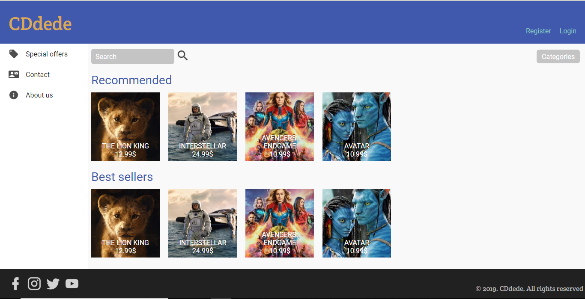
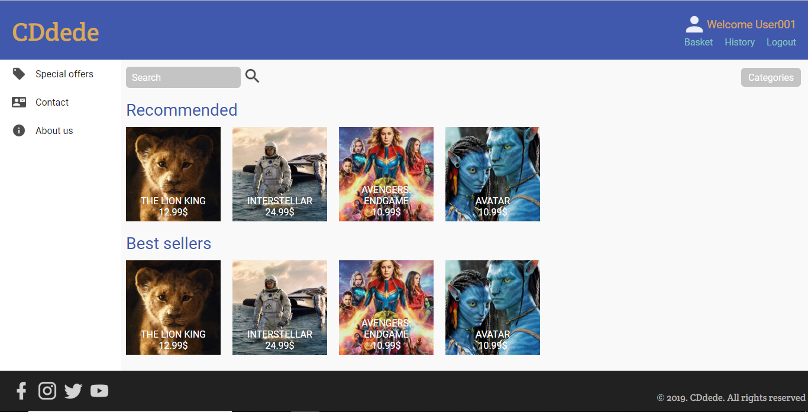
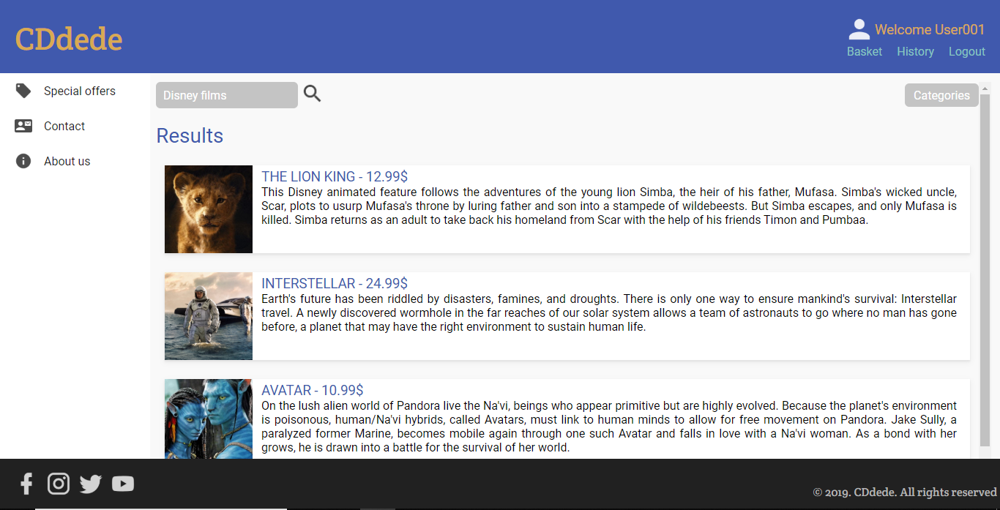
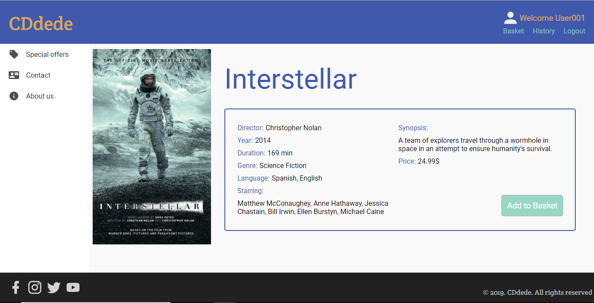
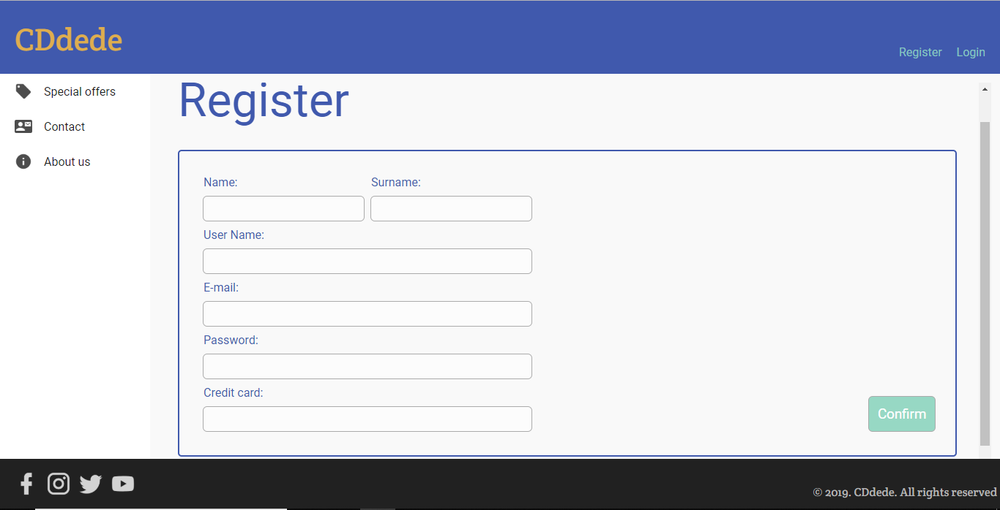
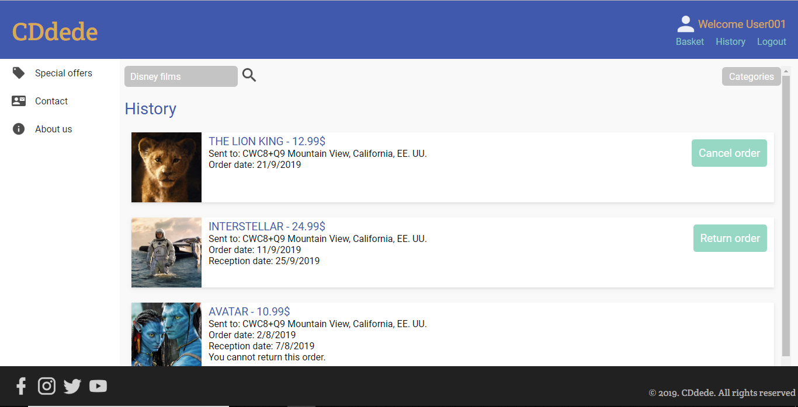

## Memoria

### Descripción de los archivos de entrega

A la hora de diseñar la página web, como el header, footer y la barra lateral no varían ningún momento (únicamente el header al logearse o cerrar sesión el usuario), hemos decidido usar un iframe para mostrar el contenido de cada página.

De esta forma, tenemos dos ficheros principales, *index.html* e *index_logged.html* que son los que almacenan el header (con el usuario logeado o no), el footer, la barra lateral y el iframe, mientras que el resto de ficheros almacenan únicamente el contenido a mostrar en el iframe. Esto permite que la navegación entre páginas sea mucho más cómoda para el usuario, y mucho más rápida, pues evitamos tener que recargar innecesariamente elementos que no han cambiado.

Para mejorar la experiencia de usuario, nos hemos encargado de añadir también algunas animaciones simples que permiten al usuario recibir un feedback cuando el puntero pasa por encima de un botón, o acciones similares.

### Descripción del funcionamiento e implementación de las páginas web

En cuanto a la implementación general de nuestra página web, cabe destacar el uso de *flexboxes* para la distribución y organización de los elementos de los distintos ficheros *.html*. De este modo conseguimos un diseño *responsive* y visualmente agradable.
También destaca el uso de `position: fixed` para establecer la posición de la cabecera, el footer y el menú lateral, pero, como al usar esta posición, estos elementos no ocupan espacio, para poder posicionar el resto de elementos correctamente, hemos decidido crear una segunda cabecera, menú lateral y footer (llamados *header filler*, *sidebar filler* y *footer filler*), cuya visualización está oculta, y que rellenan el espacio perteneciente a estos elementos.

Finalmente comentar que hemos cambiado algunos detalles de la interfaz respecto a los "mockups" para mejorar la estética de la página.

##### Index e Index_logged

Estos son los dos ficheros principales que contienen la cabecera, la barra lateral y el footer, así como el iframe en el que se mostrará el contenido de los demás ficheros según la página en la que estemos.

En la cabecera de "index" encontramos el logo de la página, que nos permite volver al "home" al clicar en él, un botón de register que nos lleva a la pantalla de registro, y un botón de login que nos lleva al "index_logged", mostrando de este modo la cabecera de un usuario que ha iniciado sesión.

En "index_logged" encontramos la cabecera para usuarios con sesión iniciada, en la que el logo aparece de igual modo que en la anterior, pero en vez de botones para hacer login y registrarse, encontramos un botón para hacer logout y volver a la cabecera anterior, otro de "history" para ir a la pantalla del historial de compras del usuario, y un botón de "basket" cuya finalidad sería dirigirse al carrito de la compra del usuario, pero que por el momento no hace nada ya que la funcionalidad del carrito aún no está implementada. Del mismo modo, también encontramos el nombre del usuario cuya sesión está iniciada y su imagen de usuario.

En ambos ficheros, el menú lateral y el footer son iguales. El menú lateral contiene  3 botones, cuya finalidad sería llevarnos a las pantallas"Special offers", que mostraría las ofertas disponibles, "About Us", con información sobre la página, y "Contact", con la información de contacto de la página; sin embargo, estas pantallas aún no están implementadas, por lo que por el momento, estos botones no realizan ninguna acción.

Por su parte el footer contiene varias imágenes que representan las distintas redes sociales en las que se podría encontrar  un usuario de la empresa, así como el texto "© 2019. CDdede. All rights reserved".

Index:

Index_logged:

##### Home

Esta es la pantalla principal de la página, en ella se muestran algunas sugerencias de compra, como los "best sellers", o una sección de películas recomendadas.
Las imágenes de muestra de las películas son a su vez links a la página de "Detail", con los detalles de la película, aunque de momento, solo se muestra la película de "Interstellar".
Cabe destacar que en esta página se dispone de un textbox para introducir parámetros de búsqueda y un botón que te dirige a la pantalla de búsqueda; así como un desplegable de "Categories" que permite realizar búsquedas de películas en función de su género.

##### Search

Esta es la pantalla de resultados de búsqueda donde se muestran las películas relacionadas con los términos de búsqueda introducidos, o bien, las películas del género seleccionado.
Del mismo modo que en la pantalla de "home", también se dispone de un textbox para introducir nuevo parámetros de búsqueda, el botón para realizar la nueva búsqueda y el desplegable de "Categories", y, de nuevo, las imágenes de las películas son links a la pantalla de "Detail".

##### Detail

Esta página muestra en detalle la información de una película, incluyendo el título, la duración, el año de salida, etc. También contiene alguna información sobre el equipo de desarrollo de la película como su directos o sus actores principales, y muestra también una imagen representativa de la película y el precio al que se vende, así como los idiomas en los que se encuentra disponible. Por último, dispone de un botón para añadir la película al carrito de la compra, pero, al no estar esta funcionalidad implementada, el botón de momento no realiza ninguna acción.

##### Register

Esta página contiene el formulario de registro de nuevos usuarios. En este formulario se pide al nuevo usuario que proporciones su nombre y apellido, un nombre de usuario para la página, un correo electrónico y los datos de su tarjeta de crédito para realizar compras, así como una contraseña para iniciar sesión en la aplicación.
El botón de "confirmar" del formulario, guardaría los datos del nuevo usuario y lo devuelve a la página principal pero como usuario con sesión iniciada; sin embargo, aún no está implementada la funcionalidad de los usuarios, por lo que, por el momento, no se almacena ningún dato y simplemente se va de vuelta a la pantalla de home con la cabecera de usuario con sesión iniciada.

##### History

La pantalla "History" nos muestra el historial de compras del usuario que tiene la sesión iniciada. Las distintas películas que aparecen en esta lista son también links a la pantalla "Detail" de dichas películas.

En las compras más recientes se muestra un botón con la opción de "Cancel order" para revertir un pedido antes de que se haya entregado, o un botón de "Return order" que permite al usuario solicitar la devolución de un pedido que ya se ha enviado en caso de que el artículo se encuentre en mal estado o esté defectuoso. Estas 2 funciones no están implementadas, y por tanto, estos 2 botones, de momento actúan como el resto de la casilla de la película y nos envían a la pantalla "Detail" de la película.