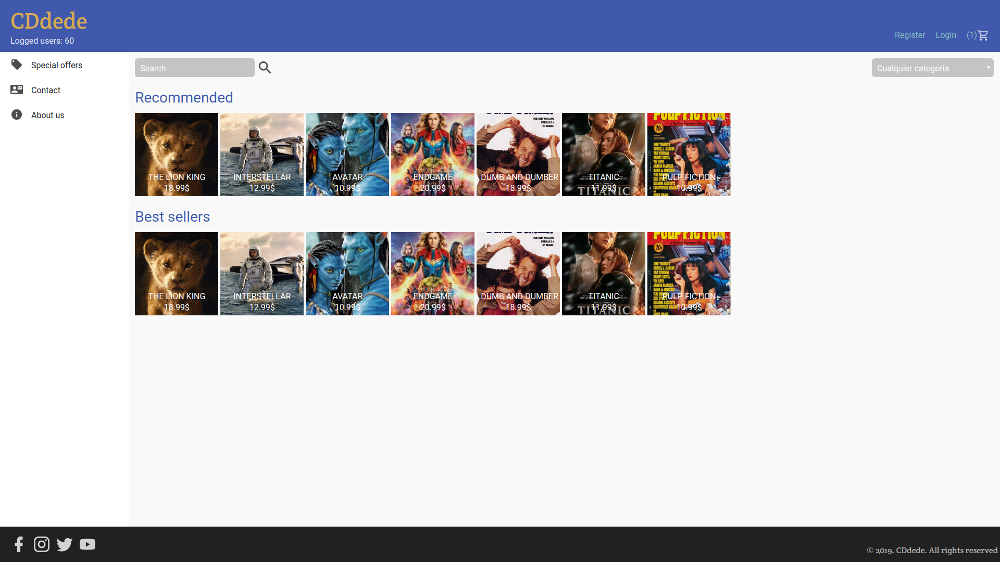
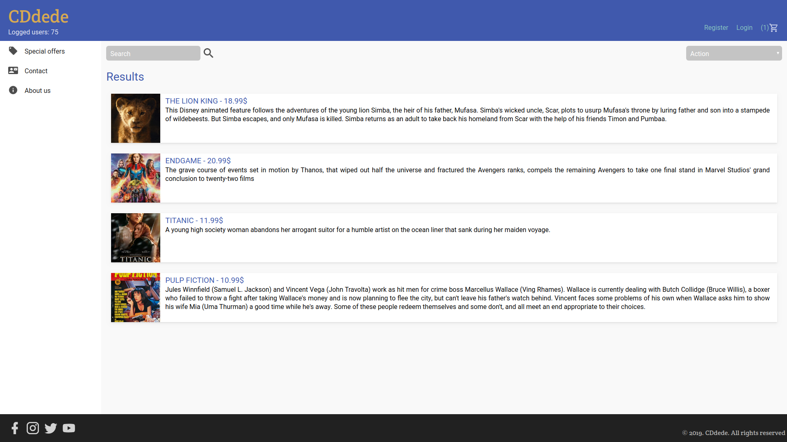
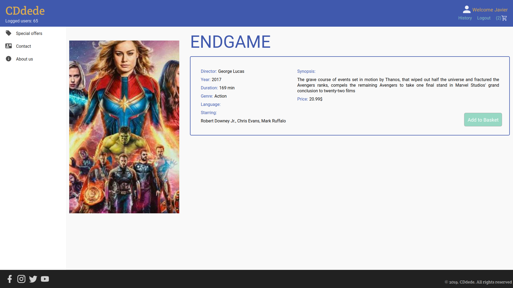
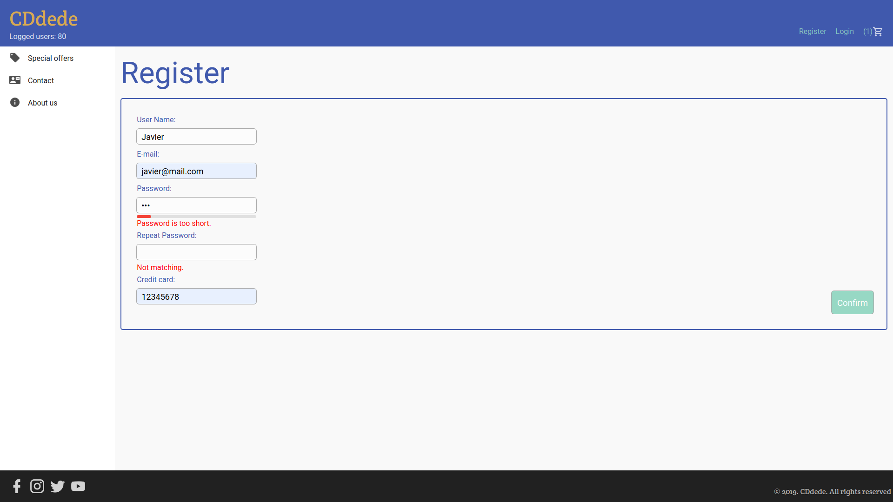
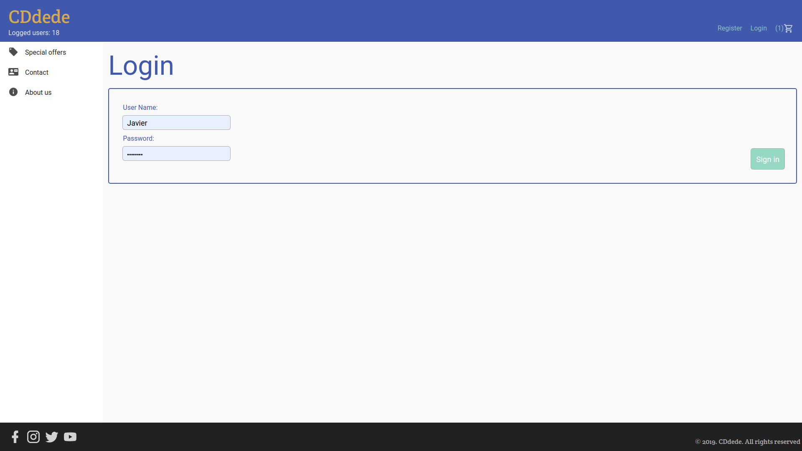
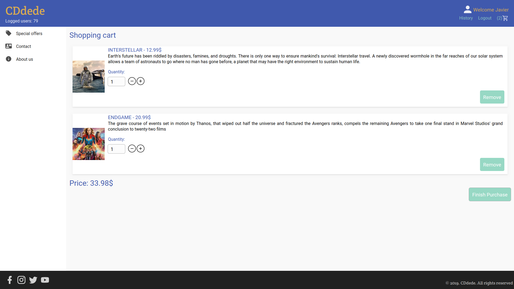
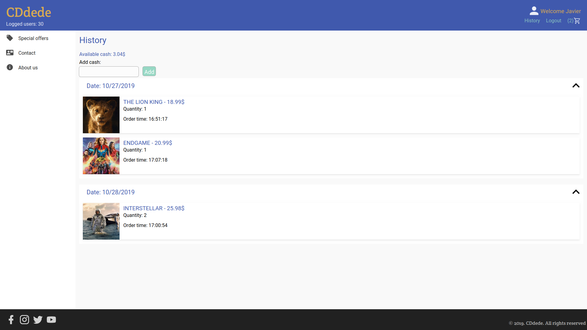

Javier Delgado del Cerro y Javier López Cano

## Práctica 2 - Memoria

### Estructura de la práctica

Hemos intentado organizar la práctica de la forma más estructurada y simple posible, de forma que en el archivo .zip entregado tenemos:

- El archivo *server.py* que contiene el código Python del servidor Flask implementado.
- La carpeta *data*, que incluye la información correspondiente a la base de datos de películas, es decir, un fichero .json que contiene el catálogo de películas, otro fichero .json que almacena la lista de categorías de películas disponibles, y una carpeta donde almacenar las carátulas de cada una de las películas de la base de datos.
- En la carpeta *static* guardamos los documentos css y las imágenes correspondientes a la página web en sí.
- En la carpeta *templates* almacenamos los documentos html de cada de una de las páginas.
- Por último, en la carpeta *usuarios* es donde almacenamos toda la información correspondiente a los usuarios del sistema, de forma que cada usuario tiene una carpeta con su nick, donde se guarda su historial etc. Comentar que la práctica se entrega con un usuario con nombre `Javier` y contraseña `12345678` que permite facilitar las pruebas en el sistema.

### Detalles de la implementación

En nuestro caso, habíamos implementado en la práctica anterior todas las páginas mediante un iframe embebido en un documento html que incluía las barras superior, inferior y lateral. En esta práctica, al usar *Jinja2* para generar las plantillas, hemos podido simplificar nuestro diseño considerablemente, usando bloques en la plantilla principal que luego podíamos sobreescribir.

De esta forma, todas páginas 'heredan' del fichero `index.html` en el que se encuentran las tres barras indicadas anteriormente.

Mencionar también que, dada la simplicidad del código JavaScript/JQuery usado, hemos pensado que era mucho más lógico que cada documento HTML incluya el código que necesita en vez de enlazarlo a un fichero *.js* distinto, pues las funciones usadas solo tienen sentido en el contexto del propio fichero.

#### Flask

Hemos desarrollado todo el servidor mediante Python3 y la librería Flask, que permite crear un servidor web básico con muchísima facilidad.

Además de elementos básicos de Flask como los decoradores que permiten asociar una url a una función determinada para devolver el html correspondiente, o la función *url_for* explicada en el enunciado, hacemos uso de dos elementos importantes:

- El objeto **session** que nos permite mantener información asociada a la sesión de un navegador. Con esto, conseguimos que el usuario pueda mantenerse loggeado, y mantener toda la información del carrito del usuario, independientemente de si se loggea o no.

- El método **set_cookie** que nos permite trabajar con cookies y así saber el nick del último usuario loggeado para poder agilizar el proceso de login una vez se tenga que repetir.

#### JQuery

Uno de los requisitos pedidos en el enunciado era la utilización de JQuery para implementar algunas funcionalidades.

En nuestro caso, hemos decidido enlazar JQuery a la última versión librería hosteada por Google, pues es bastante probable que ya esté en la caché del navegador usado por el usuario, permitiéndonos así agilizar la carga de la web.

Hemos usado la librería para tres cosas:

- Implementar en la página de registro, un medidor de fortaleza de la contraseña, que permite al usuario conocer posibles problemas de seguridad asociados a dicha contraseña. Para esto utilizamos una librería desarrollada por Dropbox que nos permite evaluar del 0 al 4 la fortaleza de una contraseña, junto con dos divs que usamos como progressbar.
- Permitir ocultar y mostrar en la pantalla Historial las compras hechas en un determinado día, empleando animaciones fluidas, de forma que el usuario no se satura de información al cargar la página web.
- Mostrar un aviso al usuario cuando se completa una compra con éxito o se añade un elemento al carrito de la compra, permitiendo a éste tener un feedback.

#### Ajax

Tal y como se pedía en el enunciado, hacemos uso de la AJAX para tener información continua del tráfico de usuarios en la web (generada de manera aleatoria realmente), que se recarga cada tres segundos. Esta información aparece en la barra superior de la web, justo debajo del nombre.

### Resultados e instrucciones de uso

Una vez explicado el desarrollo de la práctica, incluimos capturas de las distintas páginas junto con algunos detalles de su uso.

#### Home

Esta es la pantalla principal de la página, en ella se muestran algunas sugerencias de compra, como los "best sellers", o una sección de películas recomendadas. Las imágenes de muestra de las películas son a su vez links a la página de "Detail", con los detalles de la película y la opción de comprarla.

Como en todas las páginas, tenemos una barra superior con un contador del número de usuarios activos en la página (a la izquierda), y tres botones que permiten al usuario registrarse, loggearse o ver el carrito de la compra. En el caso de que el usuario ya estuviese loggeado, aparecerían en vez de los botones de Register y Login, otros de History y Logout.

Destacar además la presencia de una barra de búsqueda que incluye además un selector de la categoría en la que el usuario desee buscar.

#### Search

Esta es la pantalla de resultados de búsqueda donde se muestran las películas relacionadas con los términos de búsqueda introducidos, o bien, las películas del género seleccionado.
Del mismo modo que en la pantalla de Home, también se dispone de un textbox para introducir nuevo parámetros de búsqueda, el botón para realizar la nueva búsqueda y el selector de categoría. 

Cada resultado de búsqueda incluye una pequeña sinopsis de la película, y enlaza a la página de detail, para poder ver más información o comprarla.

#### Detail

Permite al usuario conocer información variada sobre una película determinada, además de añadirla al carrito de la compra si lo desea.

#### Register y login

Contienen el formulario de registro y login de nuevos usuarios.

En el caso de la pantalla de registro, se controlan determinados parámetros como la validez del email introducido y que las dos contraseñas coincidan y tengan una longitud mínima de ocho caracteres. Además, se proporciona un indicador de la fortaleza de la contraseña.

#### Shopping cart

Muestra el carrito de la compra de un usuario, esté o no loggeado, aunque solo permite finalizar la compra a los usuarios loggeados.

Permite además añadir varios elementos de un mismo producto, y variar dicha cantidad de forma dinámica mediante los botones **+** y **-**, mediante la caja de texto, o directamente eliminar todas las copias de un producto usando el botón *Remove*.

#### History

Aparece únicamente para los usuarios loggeados.

Por un lado, permite a un usuario consultar su saldo restante y añadir más en caso de que sea necesario para probar la funcionalidad del página.

Por otro lado, muestra todas las compras hechas por el usuario, agrupándolas según la fecha de compra en distintos desplegables.