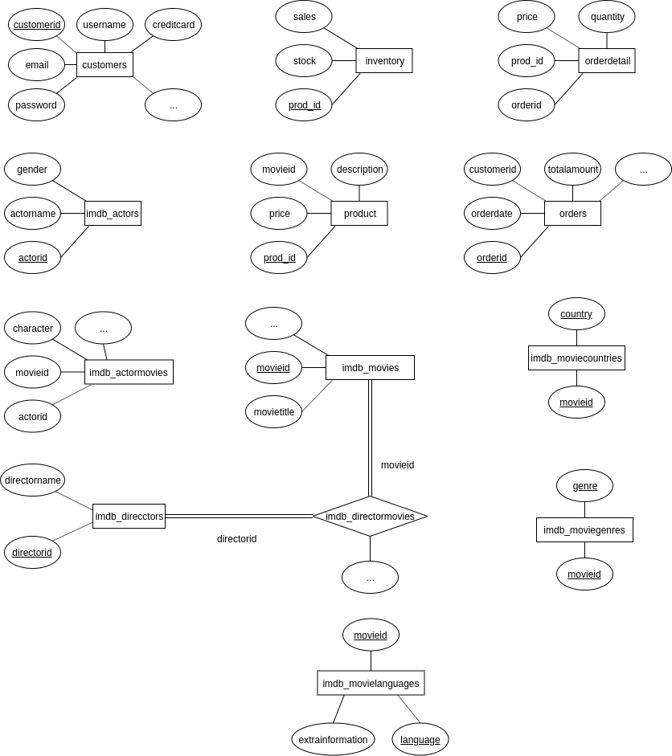
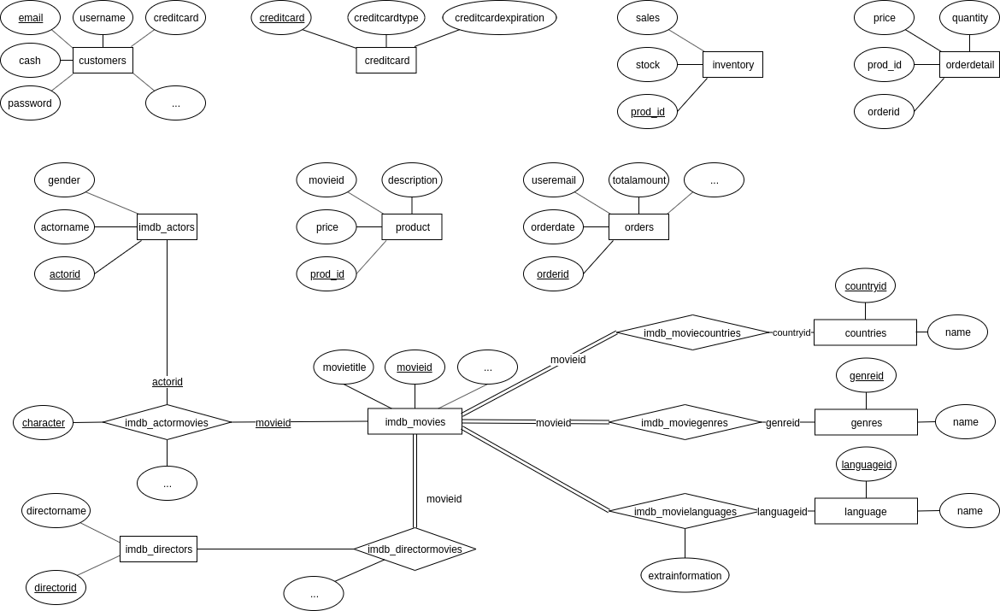

Javier Delgado del Cerro y Javier López Cano

# Memoria
### Anotaciones sobre la práctica

Hemos organizado la práctica en dos carpetas distintas, la carpeta *SQL* almacena el fichero *actualiza.sql*, y todos los ficheros de funciones y triggers pedidos. La carpeta *src* incluye el código de la aplicación en sí.

Antes de poder usar la aplicación, es necesario cargar completamente la base de datos, para lo que hemos desarrollado el script **setup.sh** que se encuentra en la carpeta *SQL* y se encarga automáticamente de eliminar la base de datos *si1*, volverla a crear a partir del archivo *dump_v1.3.sql.gz* dado, aplicar *actualiza.sql* e instalar los distintos procedimientos y triggers pedidos, que son necesarios para el correcto funcionamiento de la aplicación. Antes de instalar los triggers nos aseguramos de llamar a la función *setOrderAmount*, para que se establezcan los precios de los distintos pedidos etc.

Por último, mencionar que para facilitar la prueba de la práctica, y para conseguir que la web fuese completamente funcional, hemos implementado también la **búsqueda** (tanto por categorías como por el título de la película, usando el *full-text search* de Postgres, que nos permite obtener resultados muy buenos), el **historial** del usuario, en el que agrupamos los pedidos por el *orderid*, y una opción de añadir **cash** al usuario en la página del historial.

A la hora de mostrar las películas, como la base de datos no tenía imágenes ni sinopsis, hemos añadido diez imágenes que se establecen de forma aleatoria en cada película, y usamos una sinopsis por defecto hardcodeada en el HTML.

Un posible usuario y contraseña para probar la página es *cabral.jungle@jmail.com* con contraseña *quint*. No tiene cash, pero se le puede añadir desde la página del historial como se ha comentado anteriormente.

### Diseño inicial dado

El diagrama entidad-relación de la base de datos inicial, es el siguiente:

### Ventajas de diseño

- En general, todas las tablas tiene una gran cantidad de información y los campos de cada tabla están muy bien elegidos para contemplar todas las posibles opciones (por ejemplo, los campos *isvoice* o *creditsposition* de *imdb_actormovies*).

- La tabla *customers* está indexada por un *customerid* generado automáticamente, lo que permite al usuario cambiar su nombre y su email. En nuestro caso, sin embargo, dado que utilizamos el nombre del usuario para loggearlo y para distinguirlo del resto, es mucho más eficiente usar dicho nombre como primary key y deshacernos del *customerid*.

### Desventajas de diseño

- La tabla *customers* no tiene como restricción que el nombre de usuario sea único, por lo que tenemos que usar como identificador el email en vez de el nombre de usuario.
- La tabla *customers* mezcla la información del usuario con información de su tarjeta de crédito, que creemos estaría mejor guardada en una tabla distinta, con in id como primary key, de forma que desde *customers* se referenciase a dicha tabla.
- La tabla *inventory* usa como primary key el *prod_id*, que se refiere a un elemento de la tabla *product* (aunque no se establece como foreign key, lo que es un error). Por tanto, hay una relación uno a uno entre ambas tablas, y ambas están indexadas por el mismo atributo: es el equivalente a tener una única tabla que una las dos. Lo vamos a dejar así por si en un futuro queremos añadir más información al inventario, por ejemplo, el numero de copias de la película según el idioma o el país.
- La tabla *orderdetail* tiene un atributo *orderid* que hace referencia a una primary key de *orders*, sin embargo, no está señalado como foreign key. Además, no tiene ninguna primary key o index, lo que dificulta y raleentiza el acceso a la información.
- La tabla *orderdetail* tiene un atributo *prod_id* que hace referencia a una primary key de *products*, sin embargo, no está señalado como foreign key.
- La tabla *imdb_movies* no tiene ningún tipo de referencia a una carátula de la película, ni ningún tipo de resumen o sinopsis de la misma.
- La tabla *imdb_actormovies* no utiliza foreign key para referirse a *actorid* y a *movieid*, lo que evita que sea una relación, y puede provocar fallos de integridad bastante graves. Además, no está indexada de ninguna forma.
- Las tablas *imdb_moviecountries*, *imdb_moviegenres* e *imdb_movielanguages* están representados como atributos múltiples, no como relaciones, lo que provoca que el mismo país, género e idioma pueda estar repetido múltiples veces, y además impide desarrollar correctamente el modelo entidad-relación.

### Cambios a realizar

#### Tabla customers

- Establecer como primary key el email, pues es lo que usamos para loggear a los usuarios, y nos permitirá que este login sea mucho más rápido y eficiente. No se puede emplear el username porque hay muchos repetidos en la base de datos.
- Eliminar columnas innecesarias como: customerid, gender, income y otros campos que no pedimos en nuestro registro en la web pero en la base de datos están marcados como *NOT NULL*.
- Creamos una nueva columna *cash* que refleja el saldo del usuario, e inicializamos todos a cero.
- Almacenar las tarjetas de crédito y su información en una tabla aparte, de forma que en *consumer* simplemente tenemos un foreign key con el numero de la tarjeta.

#### Tabla orderdetail
- Hacer que el par (*orderid*, *prod_id*) sea una primary key de la tabla. De esta forma, tenemos también un índice en este par, que nos permite buscar por oderid de forma más eficiente.
- Establecer el atributo *orderid* como foreign key, pues referencia a una primary key de *orders* y usarlo además como index, pues siempre que busquemos en dicha tabla va a ser por *orderid*.
- Establecer el atributo *prod_id* como foreign key que referencia a un *prod_id* de *products*.

#### Tabla inventory

- Hacer que *prod_id* de *inventory* sea un foreign key que referencia a la primary key de products.

#### Tabla orders

- Crear una columna *useremail* que contenga el email (que actua como identificador) del usuario que realizó el pedido, y establecerlo como un foreign key.
- Borrar la columna *customerid*, que ya no tiene sentido.
- Establecer que las columnas *tax* y *totalprice* tengan valor cero por defecto, pues se deben ir actualizando al insertar elementos en *orderdetail* mediante el trigger *updOrders*.

#### Tabla imdb_movies

- Añadimos una columna *image* que contiene la dirección de la carátula de la película. Obligamos a que sea no vacía y llenamos todas las disponibles de una imagen por defecto.

#### Tabla imdb_actormovies

- Establecer las columnas *actorid* y *movieid* como foreign keys que referencian a las primary keys de las tablas *imdb_actors* e *imdb_movies* respectivamente, de forma que la tabla pasa a ser una relación.
- Usar como primary key la tupla *(movieid, actorid, character)*. De esta forma, tenemos además un index sobre estas tres columnas, que servirá también para buscar por *movieid* (aunque sea ligeramente menos eficiente que un index normal sobre dicha columna). Podríamos también establecer un index sobre *actorid* para poder ver todas las películas de un actor determinado, sin embargo, como esta funcionalidad no está disponible en nuestra página web, descartamos la idea.

#### Tablas imdb_moviecountries, imdb_moviegenres e imdb_movielanguages

- Creamos tres tablas de países, géneros e idiomas cada una con una columna *id* como primary key, y luego una relación entre cada una de las tablas y la película a través de *movieid*. De esta forma, satisfacemos el diagrama entidad relación, y evitamos posibles problemas al repetir países y géneros continuamente (podrían estar escritos de forma ligeramente distinta y provocar que algunas queries no funcionases bien)

### Diagrama final

Tras hacer todos los cambios pertinentes ya mencionados, el diagrama entidad-relación de nuestra base de datos es el siguiente:

### Queries, procedimientos y triggers

#### setPrice.sql

Usamos las tablas *orders, orderdetail* y *products* para calcular la diferencia de años entre la fecha actual y la de *orders*, digamos que es *n*, y dividir el precio de *products* entre *1,02^n*, pues el precio ha aumentado un 2% cada año. Este nuevo valor es el precio que almacenamos en *orderdetail*.

#### setOrderAmount.sql

Como hay ciertas versiones de postgresql que no soportan procedimientos almacenados, usamos una función que no devuelve ningún elemento.

Para esta función, usamos una view *setOrderAmountView* creada previamente en *actualiza.sql*, de forma que en caso de hacer varias llamadas a este procedimiento, no haya que volver a compilar la view y aumente la eficiencia.

#### getTopVentas.sql

Creamos una función que nos devuelve los productos con el mayor número de ventas para un año especificado. Para ello usamos de nuevo una view *getTopVentasView* compilada anteriormente en *actualiza.sql*.

Cuando pensamos el algoritmo, consideramos que en caso de haber varias películas con el mismo número de ventas (el máximo) en un año determinado, se deberían mostrar todas estas. Al resolver el problema de esta forma, el query es mucho más lento, lo que provoca un tiempo de carga de la página principal de la web más largo. Esto se podría solucionar cacheando el resultado en la sesión del usuario la primera vez, almacenando también la fecha actual para asegurarnos de refrescarlo, por ejemplo, una vez al día.

#### getTopMonths.sql

En este caso la función es muy simple y no requiere de ningún tipo de view.

#### updOrders.sql

Cada vez que se inserta, actualiza o elimina una fila en la tabla *orderdetail*, se actualiza la entrada de *orders* correspondiente al *prod_id* de la nueva entrada, modificando el precio total y calculando el precio con impuestos.

#### updInventory.sql

Cada vez que se modifica la columna *status* de la tabla *orders*, de forma que pasa de ser *NULL* a tener valor *Paid*, se restan del inventario todos los productos comprados y se establece una alerta en la tabla *alertas*, donde se indica el id de producto agotado.