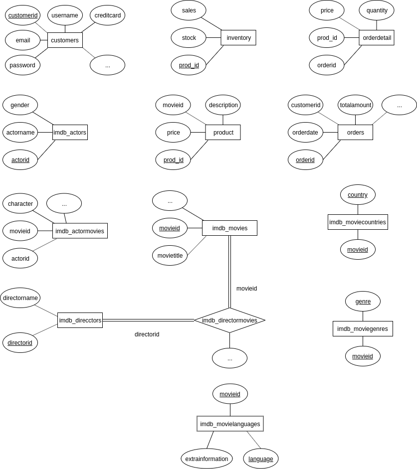
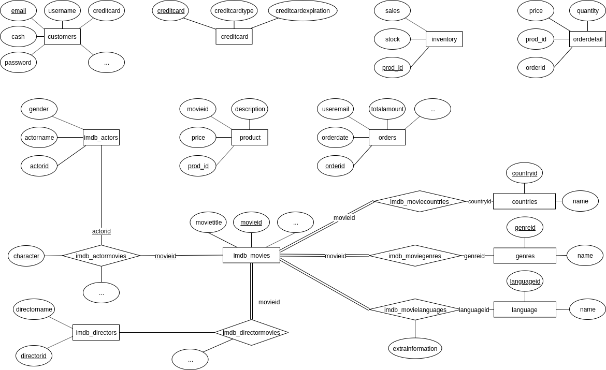

Javier Delgado del Cerro y Javier López Cano

# Memoria
### Diseño inicial dado

### Ventajas de diseño

- En general, todas las tablas tiene una gran cantidad de información y los campos de cada tabla están muy bien elegidos para contemplar todas las posibles opciones (por ejemplo, los campos *isvoice* o *creditsposition* de *imdb_actormovies*).

- La tabla *customers* está indexada por un *customerid* generado automáticamente, lo que permite al usuario cambiar su nombre y su email. En nuestro caso, sin embargo, dado que utilizamos el nombre del usuario para loggearlo y para distinguirlo del resto, es mucho más eficiente usar dicho nombre como primary key y deshacernos del *customerid*.

### Desventajas de diseño

- La tabla *customers* no tiene ese
- La tabla *customers* mezcla la información del usuario con información de su tarjeta de crédito, que creemos estaría mejor guardada en una tabla distinta, con in id como primary key, de forma que desde *customers* se referenciase a dicha tabla.
- La tabla *inventory* usa como primary key el *prod_id*, que se refiere a un elemento de la tabla *product* (aunque no se establece como foreign key, lo que es un error). Por tanto, hay una relación uno a uno entre ambas tablas, y ambas están indexadas por el mismo atributo: es el equivalente a tener una única tabla que una las dos. Lo vamos a dejar así por si en un futuro queremos añadir más información al inventario, por ejemplo, el numero de copias de la película según el idioma o el país.
- La tabla *orderdetail* tiene un atributo *orderid* que hace referencia a una primary key de *orders*, sin embargo, no está señalado como foreign key. Además, no tiene ninguna primary key o index, lo que dificulta y raleentiza el acceso a la información.
- La tabla *orderdetail* tiene un atributo *prod_id* que hace referencia a una primary key de *products*, sin embargo, no está señalado como foreign key.
- La tabla *imdb_actormovies* no utiliza foreign key para referirse a *actorid* y a *movieid*, lo que evita que sea una relación, y puede provocar fallos de integridad bastante graves. Además, no está indexada de ninguna forma.
- Las tablas *imdb_moviecountries*, *imdb_moviegenres* e *imdb_movielanguages* están representados como atributos múltiples, no como relaciones, lo que provoca que el mismo país, género e idioma pueda estar repetido múltiples veces, y además impide desarrollar correctamente el modelo entidad-relación.

### Cambios a realizar

#### Tabla customers

- Establecer como primary key el email, pues es lo que usamos para loggear a los usuarios, y nos permitirá que este login sea mucho más rápido y eficiente. No se puede emplear el username porque hay muchos repetidos en la base de datos.
- Eliminar columnas innecesarias como: customerid, gender e income.
- Creamos una nueva columna *cash* que refleja el saldo del usuario, e inicializamos todos a cero.
- Almacenar las tarjetas de crédito y su información en una tabla aparte, de forma que en *consumer* simplemente tenemos un foreign key con el numero de la tarjeta.

#### Tabla orderdetail

- Establecer el atributo *orderid* como foreign key, pues referencia a una primary key de *orders* y usarlo además como index, pues siempre que busquemos en dicha tabla va a ser por *orderid*.
- Establecer el atributo *prod_id* como foreign key que referencia a un *prod_id* de *products*.

#### Tablas inventory

- Hacer que *prod_id* de *inventory* sea un foreign key que referencia a la primary key de products.

#### Tabla orders

- Crear una columna *useremail* que contenga el email (que actua como identificador) del usuario que realizó el pedido, y establecerlo como un foreign key.

- Borrar la columna *customerid*, que ya no tiene sentido.

#### Tabla imdb_actormovies

- Establecer las columnas *actorid* y *movieid* como foreign keys que referencian a las primary keys de las tablas *imdb_actors* e *imdb_movies* respectivamente, de forma que la tabla pasa a ser una relación.
- Usar como primary key la tupla *(movieid, actorid, character)*. De esta forma, tenemos además un index sobre estas tres columnas, que servirá también para buscar por *movieid* (aunque sea ligeramente menos eficiente que un index normal sobre dicha columna). Podríamos también establecer un index sobre *actorid* para poder ver todas las películas de un actor determinado, sin embargo, como esta funcionalidad no está disponible en nuestra página web, descartamos la idea.

#### Tablas imdb_moviecountries, imdb_moviegenres e imdb_movielanguages

- Creamos tres tablas de países, géneros e idiomas cada una con una columna *id* como primary key, y luego una relación entre cada una de las tablas y la película a través de *movieid*. De esta forma, satisfacemos el diagrama entidad relación, y evitamos posibles problemas al repetir países y géneros continuamente (podrían estar escritos de forma ligeramente distinta y provocar que algunas queries no funcionases bien)

### Diagrama final

